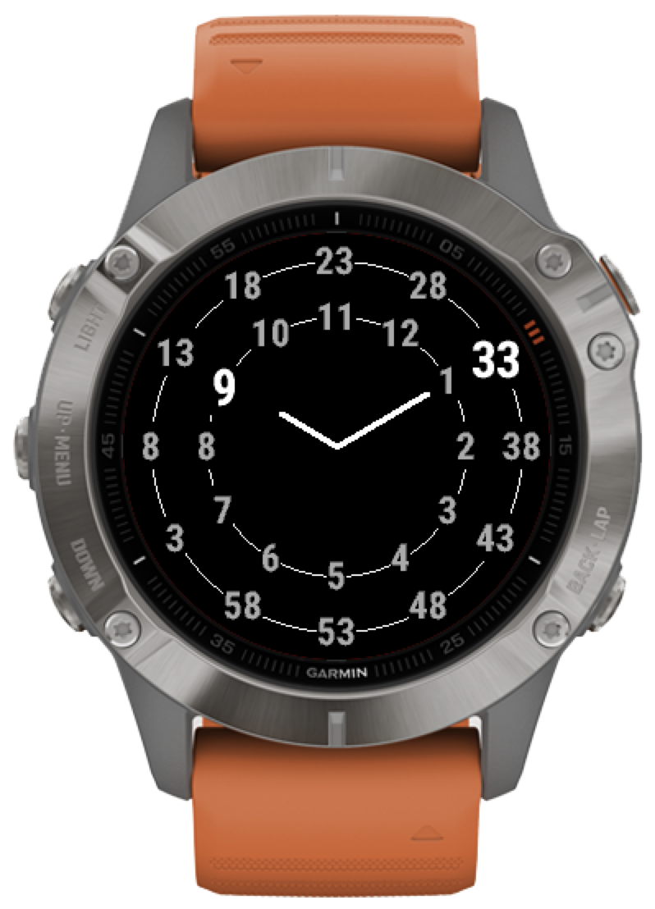

# TenTen watchface for Garmin Fenix 6

## What is this

A watchface for Garmin Fenix 6 watches, where the hands are fixed towards the 10:10 directions, and where the number rotate.

For instance, here is a view of the watchface at 9:33pm:

## How to setup

This is not the only way to develop an app or watchface for Garmin watches but it is the method recommended by Garmin.

- Set up Visual Studio Code (see https://code.visualstudio.com)
- Set up the Garmin SDK manager (see https://developer.garmin.com/connect-iq/sdk/)
- Set up the Visual Studio Code Monkey C Extension (see https://developer.garmin.com/connect-iq/sdk/)

## How to build

- Open the folder of the repo in Visual Studio Code
- Open one of the MonkeyC files, like `ten_ten_fenix_watchfaceApp.mc` for instance
- Press F5 (function key 5) to build the app and run the simulator

## How to send to the watch

- Get an app that enables to open the filesystem of the watch (for instance https://www.android.com/filetransfer/ for Mac)
- Plug the watch into the computer
- Launch the app to open the filesystem of the watch
- Copy the file `bin/ten_ten_fenix_watchface.prg` into the folder `Apps`
- Unplug the watch from the computer
- The watchface is now available on the watch and can be selected